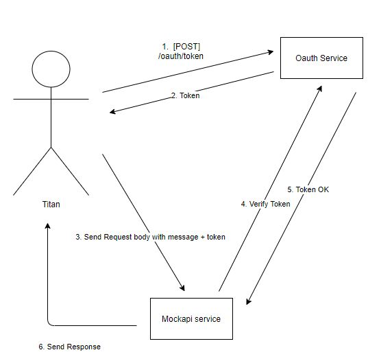

# Authentication Service



## 1\. [POST] /oauth/token

Get token

### Request body
| field | description | data type | remarks |
|----------------|--------------------------------------------------------------------------------------------------------------------------|---------------------|---|
|clientId      |                                                         | String              |   | 
|clientSecret  |                                         | String   |   | 


<br>
<br>
<br>

## 2\. [POST] /oauth/authenticate_token

Verify token sent to microservice


<br>
<br>
<br>

# How to deploy/build

## deploy microservice
There are five different ways you can express the chart you want to install:

Assuming:
- release name: release1
- chart name: authentication
- helm repo: https://github.com/migueltanada/helm_repo.git

1. By chart reference ``helm template release1 helm_repo/authentication --set configmaps.env=sit,configmaps.enable=false``
1. By path to a packaged chart: ``helm install release1 ./authentication-0.1.0.tgz``
1. By path to an unpacked chart directory: ``helm install release1 helm_repo/authentication``
1. By absolute URL: ``helm install release1 https://github.com/migueltanada/helm_repo/blob/master/authentication-0.1.0.tgz.sample?raw=true``
1. By chart reference and repo url: ``helm install --repo https://github.com/migueltanada/helm_repo release1 authentication``

## Set which config to read/create config
``--set configmaps.env=sit,configmaps.enable=false``

## build
1. ``docker build -t <image-name> .``
2. ``docker push <image-name>``

## Sample quick install
```bash

# Install ingress if (optional)
helm repo add ingress-nginx https://kubernetes.github.io/ingress-nginx
helm repo update
helm install ingress-nginx ingress-nginx/ingress-nginx --create-namespace --namespace dev


# Install app
helm install latest helm_repo/authentication --set configmaps.env=dev
```
